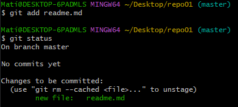
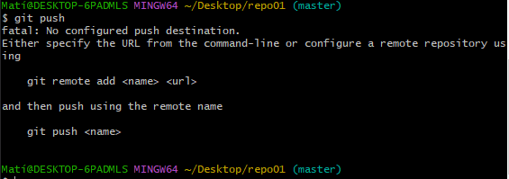
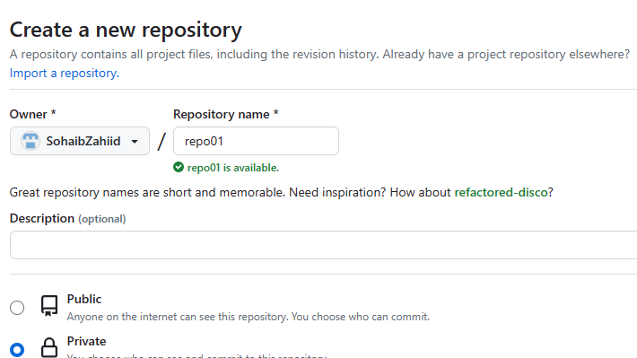
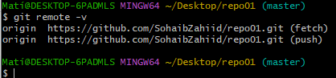
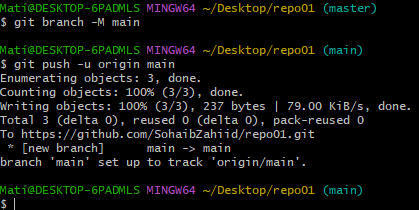
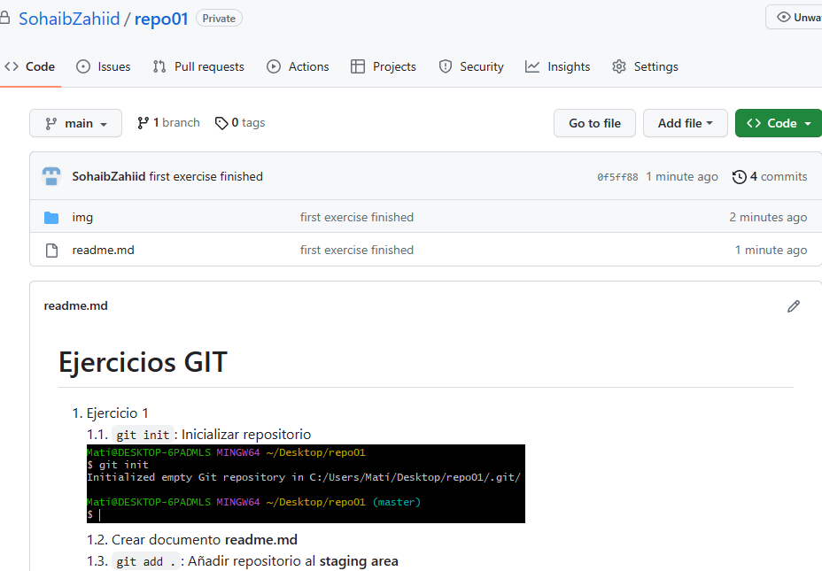

# Ejercicios GIT
1. Ejercicio 1  
  1.1. `git init`: Inicializar repositorio  
    
  1.2. Crear documento **readme.md**  
  1.3. `git add .`: Añadir repositorio al **staging area**  
    
  1.4. `git push`: Como no tenemos el repositorio conectado, no podemos hacer un push  
  1.5. `git remove -v`: No va mostrar nada  
     
   1.6. Crear un repositorio en GitHub **repo01**  
     
   1.7. Conectar **repo01** local a repositorio **repo01** GitHub  
     
   1.8. `git push -u origin main`: Subir los cambios a GitHub  
     
   1.9. En repositorio GitHub podemos ver los ficheros  
   

